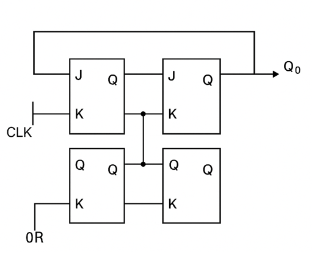
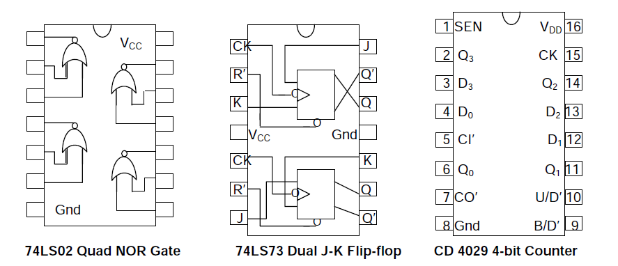
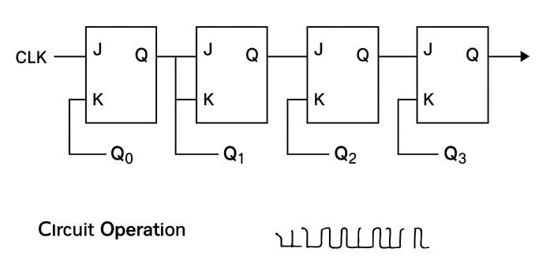
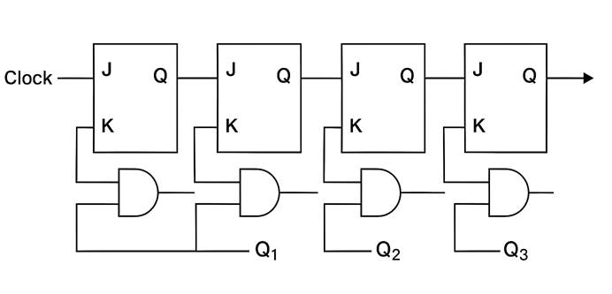
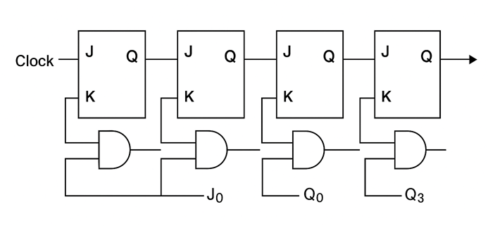
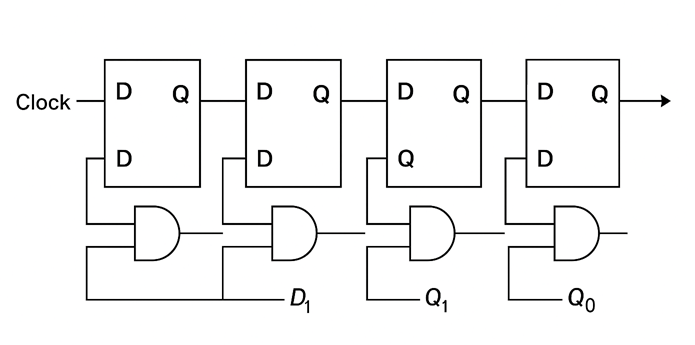
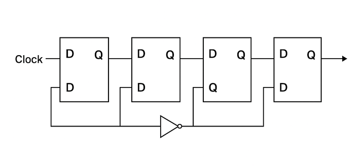
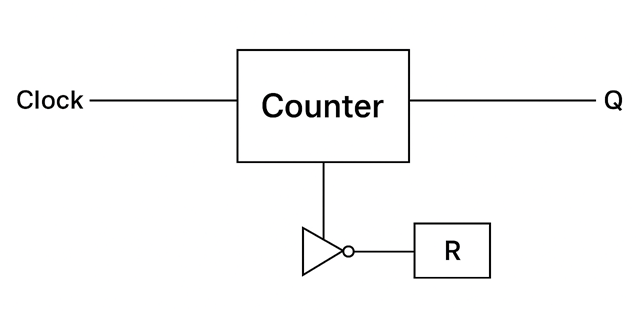

Counters are sequential digital circuits that produce a specific sequence of states through their outputs when driven by a clock signal. They are fundamental building blocks in digital systems and are used extensively in timing applications, frequency division, and control systems.

### Binary Counters

A binary counter is a sequential circuit that counts in binary sequence (0, 1, 2, 3, ...). It consists of a series of flip-flops connected to count in binary progression. Binary counters are fundamental building blocks in digital systems and are used to track events, generate timing signals, and perform frequency division.

#### Logic Equations

For a basic binary counter using JK flip-flops:

**J = K = 1** (converts JK flip-flops to T flip-flops)

This configuration makes each flip-flop toggle on every active clock edge, creating the binary counting sequence. The decimal equivalent of the count equals **2³×Q₃ + 2²×Q₂ + 2¹×Q₁ + 2⁰×Q₀**.

#### Key Features

- Counts in natural binary sequence (2ⁿ states for n flip-flops)
- Can be implemented as asynchronous (ripple) or synchronous counters
- Each flip-flop represents one bit of the count
- Output changes with each clock pulse
- Essential component in digital timing and control systems

#### Circuit Implementation

The counters are assembled using two 74LS73 dual J-K flip-flop chips and a 74LS02 quad NOR chip. Each flip-flop has an asynchronous Reset (R') input besides the synchronous J-K inputs, enabling reset of any flip-flop by making R' = 0 irrespective of the clock status.

#### Experimental Setup

1. Make J = K = 1 for all flip-flops, converting J-K flip-flops to T flip-flops
2. Connect all R' inputs to an Input Switch, and outputs Q0, Q1, Q2, Q3 to LED displays
3. Set up Up-counting Binary Ripple Counter: CK0 = Manual Clock, CK1 = Q0, CK2 = Q1, CK3 = Q2
4. Apply clock pulses and tabulate the state sequence
5. For Down-counting: connect CK1 = Q0', CK2 = Q1', CK3 = Q2'

#### Applications

- Digital clocks and timers
- Frequency dividers in communication systems
- Address generation in memory systems
- Event counting in industrial automation
- Microprocessor program counters

### Asynchronous (Ripple) Counter

An asynchronous counter, also known as a ripple counter, is a circuit where flip-flops are not clocked simultaneously. Instead, the output of each flip-flop serves as the clock input for the next flip-flop in the chain. The clock signal "ripples" through the flip-flops from LSB to MSB.

#### Understanding Circuit Layout vs. Computational Flow

**Traditional Sequential Notation**: Counter states are typically written with MSB (Most Significant Bit) on the left and LSB (Least Significant Bit) on the right, such as Q₃Q₂Q₁Q₀ for a 4-bit counter.

**Computational Flow in Ripple Counters**: However, the actual counting propagation starts from the LSB and ripples toward the MSB. This is because:

- Counting begins with the rightmost (least significant) bit
- Any state change must propagate leftward to the next higher bit position
- The clock signal "ripples" from LSB→MSB (right to left in traditional notation)

**Simulation Demo Layout**: In our interactive simulation, the circuit may be arranged to clearly visualize this computational flow and help students understand the sequential nature of state propagation.

#### Logic Equations

For a 4-bit ripple counter, each bit position has its own toggle behavior. The key concept is that each stage depends on the output from the previous stage. The counting process flows from right to left (LSB to MSB):

**Bit 0 (LSB - Rightmost):**

- Input: External Clock
- Output: Q₀ toggles on each clock pulse

**Bit 1:**

- Input: Q₀ output (or Q₀' for down counter)
- Output: Q₁ toggles when Q₀ changes from 1→0

**Bit 2:**

- Input: Q₁ output (or Q₁' for down counter)
- Output: Q₂ toggles when Q₁ changes from 1→0

**Bit 3 (MSB - Leftmost):**

- Input: Q₂ output (or Q₂' for down counter)
- Output: Q₃ toggles when Q₂ changes from 1→0

#### Circuit Operation

**Clock Connections for 4-bit Up Counter:**

- CK₀ = External Clock (CLK)
- CK₁ = Q₀ (output of first flip-flop)
- CK₂ = Q₁ (output of second flip-flop)
- CK₃ = Q₂ (output of third flip-flop)

**For Down Counter:** Replace Q with Q̄ (complement outputs)

#### Key Features

- Simple design with minimal hardware
- Lower power consumption compared to synchronous counters
- Propagation delay increases with number of stages
- May produce glitches during state transitions
- Clock frequency limited by cumulative propagation delays
- The count "ripples" from LSB to MSB, which is why it is called a ripple counter
- Counting starts from the rightmost bit (LSB) and propagates leftward to the MSB

#### Truth Table (4-bit Ripple Counter)

| Clock | Q₃  | Q₂  | Q₁  | Q₀  | Decimal |
| ----- | --- | --- | --- | --- | ------- |
| 0     | 0   | 0   | 0   | 0   | 0       |
| 1     | 0   | 0   | 0   | 1   | 1       |
| 2     | 0   | 0   | 1   | 0   | 2       |
| 3     | 0   | 0   | 1   | 1   | 3       |
| 4     | 0   | 1   | 0   | 0   | 4       |
| 5     | 0   | 1   | 0   | 1   | 5       |
| 6     | 0   | 1   | 1   | 0   | 6       |
| 7     | 0   | 1   | 1   | 1   | 7       |
| 8     | 1   | 0   | 0   | 0   | 8       |
| 9     | 1   | 0   | 0   | 1   | 9       |
| 10    | 1   | 0   | 1   | 0   | 10      |
| 11    | 1   | 0   | 1   | 1   | 11      |
| 12    | 1   | 1   | 0   | 0   | 12      |
| 13    | 1   | 1   | 0   | 1   | 13      |
| 14    | 1   | 1   | 1   | 0   | 14      |
| 15    | 1   | 1   | 1   | 1   | 15      |
| 16    | 0   | 0   | 0   | 0   | 0       |

#### Applications

- **Low-frequency digital systems**: Basic timing and control applications
- **Battery-powered devices**: Efficient for low-power applications due to minimal hardware
- **Simple counting applications**: Basic event counting and frequency measurement
- **Educational demonstrations**: Teaching sequential logic and binary counting concepts
- **Basic digital clocks**: Simple timekeeping applications where speed is not critical

### Synchronous Counter

A synchronous counter is a sequential circuit where all flip-flops are clocked simultaneously by the same clock signal. This eliminates the propagation delay issues found in ripple counters and allows for higher-speed operation.

#### Principle of Operation

**Synchronous Operation**: All flip-flops change state simultaneously on the same clock edge.
**Parallel Logic Control**: Each flip-flop's J and K inputs are controlled by combinational logic that determines when that particular bit should toggle based on the current state of all lower-order bits.

The synchronous design eliminates the cumulative propagation delay found in ripple counters, allowing for much higher operating frequencies.

#### Logic Equations

For each bit position i in a synchronous binary counter:

- **J₀ = K₀ = 1** (LSB toggles on every clock pulse)
- **J₁ = K₁ = Q₀** (toggles when Q₀ is HIGH)
- **J₂ = K₂ = Q₀ · Q₁** (toggles when both Q₀ and Q₁ are HIGH)
- **J₃ = K₃ = Q₀ · Q₁ · Q₂** (toggles when Q₀, Q₁, and Q₂ are all HIGH)

#### Circuit Operation

All flip-flops receive the same clock signal, but their J and K inputs are controlled by logic gates that determine when each flip-flop should toggle based on the current state of lower-order bits.

**Toggle Conditions:**

- Bit 0: Toggles every clock pulse
- Bit 1: Toggles when bit 0 is HIGH
- Bit 2: Toggles when bits 1 and 0 are HIGH
- Bit n: Toggles when all lower bits (n-1 to 0) are HIGH

#### Key Features

- All flip-flops change state simultaneously on the same clock edge
- No propagation delay between stages (eliminates cumulative delay)
- Higher operating frequency capability compared to ripple counters
- More complex control logic required for toggle conditions
- Eliminates glitches during state transitions
- Faster and more reliable than asynchronous counters
- Requires additional AND gates for control logic

#### Applications

- **High-speed digital systems**: Processors and high-frequency applications
- **Microprocessor timing circuits**: CPU clock generation and timing control
- **Digital signal processing**: High-speed mathematical operations
- **Communication systems**: Fast data processing and protocol handling
- **Precision timing applications**: Accurate time measurement and control systems

### Decade Counter (BCD Counter)

A decade counter, also known as a BCD (Binary Coded Decimal) counter, counts from 0 to 9 and then resets to 0. It uses 4 flip-flops but only utilizes 10 of the possible 16 states, making it ideal for decimal-based applications.

#### Principle of Operation

**Decade Counting**: The counter performs normal binary counting from 0000 to 1001 (0 to 9 in decimal).
**Reset Logic**: When the counter reaches 1010 (decimal 10), it immediately resets to 0000 through additional reset circuitry.

The decade counter essentially creates a modulo-10 counter by truncating the normal 16-state binary sequence to only 10 states, making it perfect for decimal digit representation.

#### Logic Equations

For a synchronous decade counter:

- **J₀ = K₀ = 1**
- **J₁ = Q₀ · Q₃', K₁ = Q₀**
- **J₂ = K₂ = Q₀ · Q₁**
- **J₃ = Q₀ · Q₁ · Q₂, K₃ = Q₀**

#### Circuit Operation

The decade counter modifies a standard 4-bit binary counter by adding reset logic that forces the counter to return to 0000 when it reaches 1010 (decimal 10).

**Reset Logic:** R' = (Q₃ · Q₁)' for all flip-flops

This creates the count sequence: 0 → 1 → 2 → 3 → 4 → 5 → 6 → 7 → 8 → 9 → 0...

The decimal equivalent of the count equals **8×Q₃ + 4×Q₂ + 2×Q₁ + 1×Q₀** for valid BCD states.

#### Truth Table

| Clock | Q₃  | Q₂  | Q₁  | Q₀  | Decimal |
| ----- | --- | --- | --- | --- | ------- |
| 0     | 0   | 0   | 0   | 0   | 0       |
| 1     | 0   | 0   | 0   | 1   | 1       |
| 2     | 0   | 0   | 1   | 0   | 2       |
| 3     | 0   | 0   | 1   | 1   | 3       |
| 4     | 0   | 1   | 0   | 0   | 4       |
| 5     | 0   | 1   | 0   | 1   | 5       |
| 6     | 0   | 1   | 1   | 0   | 6       |
| 7     | 0   | 1   | 1   | 1   | 7       |
| 8     | 1   | 0   | 0   | 0   | 8       |
| 9     | 1   | 0   | 0   | 1   | 9       |
| 10    | 0   | 0   | 0   | 0   | 0       |

#### Key Features

- Counts in decimal sequence (0-9) then resets
- Uses 4 flip-flops but only 10 of 16 possible states
- Automatic reset when reaching decimal 10
- Compatible with BCD (Binary Coded Decimal) systems
- Essential for decimal display applications
- More complex reset logic than simple binary counters

#### Applications

- **Digital clocks and watches**: Hours, minutes, and seconds display
- **Decimal counters and displays**: Seven-segment display drivers
- **Frequency dividers (÷10)**: Creating decade frequency relationships
- **BCD arithmetic circuits**: Decimal arithmetic processing units
- **Industrial process control**: Decimal counting and measurement systems

### Ring Counter

A ring counter is a special type of counter where the output of the last flip-flop is connected back to the input of the first flip-flop, forming a circular or "ring" configuration. Only one flip-flop is HIGH at any time, and this HIGH state circulates through the counter.

#### Principle of Operation

**Circular Data Flow**: The output of the last stage feeds back to the input of the first stage, creating a closed loop.
**Single Active Bit**: Only one flip-flop output is HIGH (1) at any given time, while all others remain LOW (0).
**Sequential Shifting**: The active HIGH bit "walks" through the counter in sequence with each clock pulse.

The ring counter creates a sequence where exactly one output is active at a time, making it ideal for applications requiring sequential activation of multiple devices or processes.

#### Logic Equations

For an n-bit ring counter, the data input for each flip-flop comes from the previous stage:

- **D₀ = Qₙ₋₁** (input to first flip-flop comes from last flip-flop)
- **D₁ = Q₀** (input to second flip-flop comes from first flip-flop)
- **D₂ = Q₁** (input to third flip-flop comes from second flip-flop)
- **Dᵢ = Qᵢ₋₁** (general form for any flip-flop i)

#### Circuit Operation

The ring counter requires initialization to place a single '1' in the first flip-flop and '0' in all others. This is achieved using preset and clear inputs:

- **Preset:** Applied to the first flip-flop (sets Q₁ = 1)
- **Clear:** Applied to all other flip-flops (sets Q₂ = Q₃ = ... = 0)

#### Key Features

- Number of states equals number of flip-flops (n flip-flops = n states)
- Only one output is HIGH at any time (one-hot encoding)
- Self-starting with proper initialization
- Decoded outputs (no additional decoding required)
- Simple control logic with direct feedback connection
- Natural sequence generation without complex decode logic

#### Truth Table (4-bit Ring Counter)

| Clock | Q₃  | Q₂  | Q₁  | Q₀  |
| ----- | --- | --- | --- | --- |
| 0     | 0   | 0   | 0   | 1   |
| 1     | 0   | 0   | 1   | 0   |
| 2     | 0   | 1   | 0   | 0   |
| 3     | 1   | 0   | 0   | 0   |
| 4     | 0   | 0   | 0   | 1   |

#### Applications

- **Sequence generators**: Creating timed sequential events
- **Control signal generation**: Sequential activation of system components
- **Multiplexer/demultiplexer control**: Channel selection in data routing
- **State machine implementations**: Simple sequential state control
- **Rotating displays and indicators**: LED pattern generation and visual effects

### Johnson Counter (Twisted Ring Counter)

A Johnson counter, also known as a twisted ring counter, is a variation of the ring counter where the complement of the last flip-flop output is fed back to the first flip-flop input. This creates a counter with 2n states for n flip-flops.

#### Principle of Operation

**Twisted Feedback**: Unlike a regular ring counter, the Johnson counter feeds back the complement (Q̄) of the last flip-flop to the first flip-flop.
**Fill and Empty Sequence**: The counter first "fills" with 1s from right to left, then "empties" with 0s from right to left.
**Double State Count**: An n-bit Johnson counter produces 2n unique states, twice as many as a ring counter.

The twisted feedback creates a unique counting sequence that naturally avoids forbidden states and provides excellent self-correction properties.

#### Logic Equations

For an n-bit Johnson counter:

- **D₀ = Q̄ₙ₋₁** (input to first flip-flop is complement of last flip-flop)
- **D₁ = Q₀** (input to second flip-flop comes from first flip-flop)
- **D₂ = Q₁** (input to third flip-flop comes from second flip-flop)
- **Dᵢ = Qᵢ₋₁** (general form for flip-flops 1 to n-1)

#### Circuit Operation

The Johnson counter connects the Q̄ output of the last flip-flop to the input of the first flip-flop, creating a sequence where the counter fills with 1s and then empties with 0s.

#### Key Features

- 2n states for n flip-flops (double the states of a ring counter)
- Self-correcting (automatically recovers from illegal states)
- No decoding gates required for most applications
- Glitch-free operation due to systematic state transitions
- Simple implementation with just one inverter added to ring counter
- Natural protection against forbidden state lockup

#### Truth Table (3-bit Johnson Counter)

| Clock | Q₂  | Q₁  | Q₀  |
| ----- | --- | --- | --- |
| 0     | 0   | 0   | 0   |
| 1     | 0   | 0   | 1   |
| 2     | 0   | 1   | 1   |
| 3     | 1   | 1   | 1   |
| 4     | 1   | 1   | 0   |
| 5     | 1   | 0   | 0   |
| 6     | 0   | 0   | 0   |

#### Applications

- **Frequency dividers**: Creating precise frequency division ratios
- **Sequence detection**: Pattern recognition in digital systems
- **Control signal generation**: Multi-phase timing signal generation
- **Digital phase-locked loops**: Clock recovery and synchronization circuits
- **Waveform generation**: Creating specific digital waveform patterns

### Modulo-N Counters

A modulo-N counter is a counter that counts from 0 to N-1 and then resets to 0. These counters are designed to have any desired number of states, not just powers of 2.

#### Principle of Operation

**Modulo-N Counting**: The counter performs normal binary counting until it reaches count N, then immediately resets to 0.
**Custom Modulus**: N can be any desired number, not restricted to powers of 2 (2, 4, 8, 16, etc.).
**Efficient Design**: Uses the minimum number of flip-flops needed to represent the highest count value.

Modulo-N counters provide maximum flexibility in creating custom counting sequences for specific applications where standard binary or decade counting is not suitable.

#### Logic Equations

For a modulo-N counter, the reset logic is designed to detect when the count reaches N:

**Reset Logic:** R' = (Detection of state N)'

The specific logic depends on the binary representation of N. For example:

- **Modulo-6**: Reset when Q₂Q₁Q₀ = 110₂ (decimal 6)
- **Modulo-12**: Reset when Q₃Q₂Q₁Q₀ = 1100₂ (decimal 12)

#### Design Principle

To create a modulo-N counter:

1. Use the minimum number of flip-flops required (⌈log₂(N)⌉)
2. Add reset logic to force the counter to 0 when it reaches state N
3. The reset logic detects the Nth state and immediately resets all flip-flops

#### Key Features

- Flexible counting sequence (any modulus from 1 to maximum flip-flop capacity)
- Custom state sequences possible for specialized applications
- Uses minimum hardware for required states (optimal flip-flop count)
- Reset logic increases complexity slightly but provides maximum flexibility
- Efficient for non-binary applications requiring specific count sequences
- Can be implemented as either synchronous or asynchronous designs

#### Applications

- **Custom frequency division**: Creating non-standard frequency ratios
- **Non-binary counting systems**: Specialized counting requirements
- **Traffic light controllers**: Custom timing sequences for traffic management
- **Industrial process timing**: Specialized manufacturing sequence control
- **Specialized sequencing applications**: Any application requiring custom count patterns
